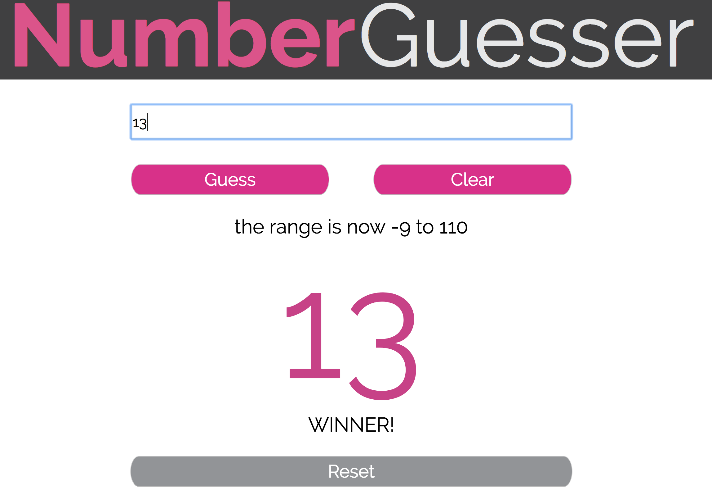

# Nummber Guesser
Number guesser was an exercise in understanding of vanilla javascript and DOM manipulation. A user guesses a number within the displayed range, once a user has correctly guessed the randomly generated number they win the initial phase of the game. At this point they are prompted the view changes and the user is presetend with the option to choose their own range. After winning the custom game a celebration animation is displayed.  

## Getting Started
clone down the repo.

### Running
cd into directory.
open index.html from terminal.

## Built With
Vanilla JavaScript, HTM5 & CSS3

## Authors
***Gavin Love** - *Initial work* - [gavin-love](hhttps://github.com/gavin-love)

